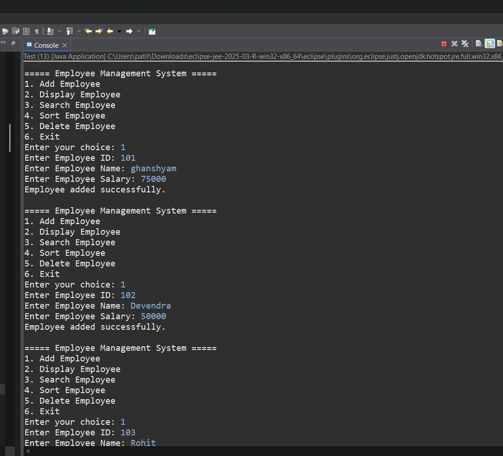
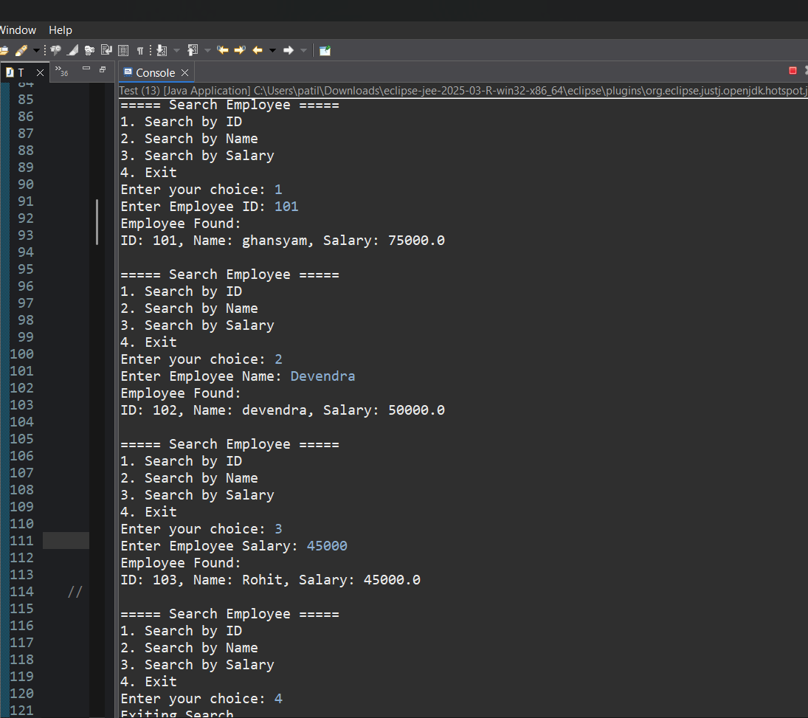
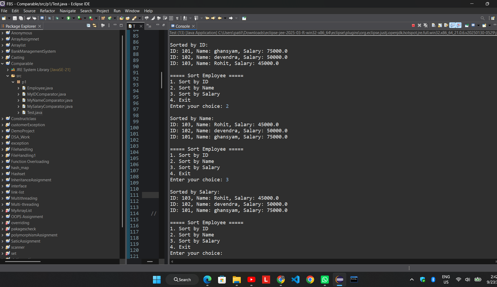
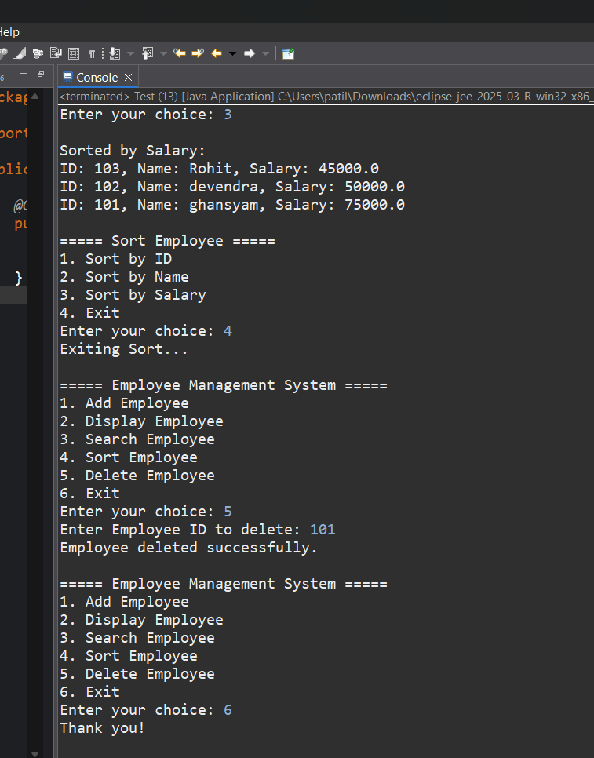

# Employee Management System – Java

## Project Description

Employee Management System is a menu-driven Java application developed using Object-Oriented Programming concepts.

The project uses ArrayList to manage employee records and demonstrates Comparable and Comparator for sorting employees based on different attributes.

## Features

- Add Employee
- Display Employee
- Search Employee by ID, Name and Salary
- Sort Employee by ID, Name and Salary
- Delete Employee
- Menu-driven console application
- Uses ArrayList
- Uses Comparable
- Uses Comparator

  ## Technologies Used

- Java
- OOP
- ArrayList
- Comparable
- Comparator
- Eclipse IDE

- ## Project Screenshots

### Add Employee

### Search Employee

### Sort Employee

### Delete Employee

